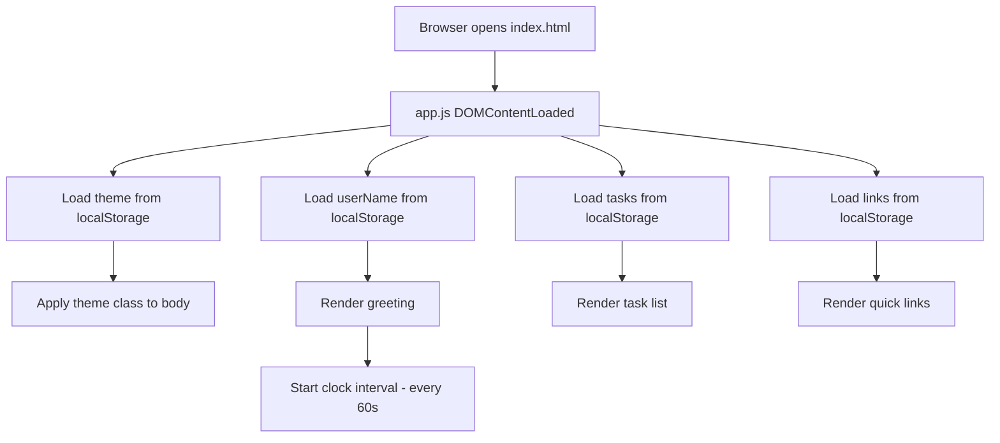

# Design Document: Personal Dashboard

## Overview

A single-page personal dashboard built with vanilla HTML, CSS, and JavaScript. The app runs entirely in the browser with no build step or backend — just open `index.html` directly. All state is persisted to `localStorage`. The UI is composed of four widgets (Greeting, Focus Timer, To-Do List, Quick Links) plus a global theme toggle and name-entry control.

The architecture is intentionally flat: one HTML file for structure, one CSS file for presentation, one JS file for all behavior. No module bundler, no framework, no dependencies.

---

## Architecture

```
personal-dashboard/
├── index.html          # All markup; links css/style.css and js/app.js
├── css/
│   └── style.css       # All styles; CSS custom properties drive theming
└── js/
    └── app.js          # All behavior; self-contained IIFE, no globals leaked
```

### Runtime Flow



### Interaction Model

All user interactions are handled via event delegation on stable container elements. Widget state is kept in plain JS arrays/objects in memory and mirrored to `localStorage` on every mutation. There is no virtual DOM or reactive framework — DOM is updated imperatively after each state change.

---

## Components and Interfaces

### Clock / Greeting Widget

Responsible for displaying the current time, date, and a time-based greeting with the optional user name.

**DOM elements:**
- `#clock` — displays HH:MM
- `#date` — displays full human-readable date
- `#greeting` — displays greeting phrase + name

**Functions:**
```js
updateClock()          // reads Date(), updates #clock, #date, #greeting
getGreetingPhrase(hour) // pure: returns "Good Morning" | "Good Afternoon" | "Good Evening" | "Good Night"
formatTime(date)        // pure: returns "HH:MM" string
formatDate(date)        // pure: returns e.g. "Monday, April 26, 2025"
```

A `setInterval` fires `updateClock()` every 60 000 ms. It also fires once immediately on load.

### User Name

**DOM elements:**
- `#name-input` — text input
- `#name-save` — save button

**Functions:**
```js
saveName(name)   // trims, writes to localStorage key "userName", calls updateClock()
loadName()       // reads localStorage key "userName", returns string or ""
```

### Focus Timer

Self-contained countdown timer. State is kept in three module-level variables: `remaining` (seconds), `running` (bool), `intervalId`.

**DOM elements:**
- `#timer-display` — shows MM:SS
- `#timer-start` — start button (disabled while running)
- `#timer-stop` — pause button
- `#timer-reset` — reset button

**Functions:**
```js
startTimer()     // sets running=true, starts interval, disables start btn
stopTimer()      // clears interval, sets running=false
resetTimer()     // calls stopTimer(), sets remaining=1500, updates display
tickTimer()      // decrements remaining, updates display; if 0 calls onTimerComplete()
onTimerComplete() // calls stopTimer(), shows notification
formatTimerDisplay(seconds) // pure: returns "MM:SS"
```

### To-Do List

Tasks are stored as an array of objects in memory and serialized to `localStorage`.

**DOM elements:**
- `#todo-input` — text input
- `#todo-add` — add button
- `#todo-list` — `<ul>` container (event-delegated)
- `#todo-duplicate-warning` — inline warning element

**Task object shape:**
```js
{ id: string, text: string, completed: boolean }
```

**Functions:**
```js
addTask(text)            // validates, checks duplicate, pushes to tasks[], persists, renders
deleteTask(id)           // filters tasks[], persists, renders
toggleTask(id)           // flips completed, persists, renders
editTask(id, newText)    // updates text, persists, renders
renderTasks()            // rebuilds #todo-list DOM from tasks[]
persistTasks()           // JSON.stringify tasks[] → localStorage "tasks"
loadTasks()              // JSON.parse from localStorage "tasks" → tasks[]
isDuplicate(text)        // pure: checks tasks[] for case-insensitive match on incomplete tasks
```

### Quick Links

Links are stored as an array of objects in memory and serialized to `localStorage`.

**DOM elements:**
- `#link-label-input` — label text input
- `#link-url-input` — URL text input
- `#link-add` — add button
- `#links-container` — container div (event-delegated)
- `#link-validation-msg` — inline validation message element

**Link object shape:**
```js
{ id: string, label: string, url: string }
```

**Functions:**
```js
addLink(label, url)      // validates, normalizes URL, pushes to links[], persists, renders
deleteLink(id)           // filters links[], persists, renders
renderLinks()            // rebuilds #links-container DOM from links[]
persistLinks()           // JSON.stringify links[] → localStorage "links"
loadLinks()              // JSON.parse from localStorage "links" → links[]
normalizeUrl(url)        // pure: prepends "https://" if no http(s):// prefix
```

### Theme Toggle

**DOM elements:**
- `#theme-toggle` — button/checkbox

**Functions:**
```js
applyTheme(theme)        // sets data-theme attr on <body>, persists to localStorage "theme"
loadTheme()              // reads localStorage "theme", defaults to "light"
```

CSS uses `[data-theme="dark"]` selector to swap custom properties.

---

## Data Models

All data lives in `localStorage` under these keys:

| Key | Type | Description |
|-----|------|-------------|
| `"userName"` | `string` | User's display name, or absent if never set |
| `"theme"` | `"light" \| "dark"` | Active theme, defaults to `"light"` |
| `"tasks"` | `JSON string` | Array of Task objects |
| `"links"` | `JSON string` | Array of Link objects |

### Task Schema

```json
{
  "id": "t_1714123456789",
  "text": "Buy groceries",
  "completed": false
}
```

IDs are generated as `"t_" + Date.now()` at creation time — sufficient for a single-user, single-tab app.

### Link Schema

```json
{
  "id": "l_1714123456790",
  "label": "GitHub",
  "url": "https://github.com"
}
```

IDs follow the same `"l_" + Date.now()` pattern.

### CSS Custom Properties (Theme)

```css
:root {
  --bg: #ffffff;
  --surface: #f5f5f5;
  --text: #111111;
  --accent: #4f46e5;
  --border: #e0e0e0;
}

[data-theme="dark"] {
  --bg: #0f0f0f;
  --surface: #1a1a1a;
  --text: #f0f0f0;
  --accent: #818cf8;
  --border: #2a2a2a;
}
```

---

## Correctness Properties

*A property is a characteristic or behavior that should hold true across all valid executions of a system — essentially, a formal statement about what the system should do. Properties serve as the bridge between human-readable specifications and machine-verifiable correctness guarantees.*

### Property 1: Time formatting produces valid HH:MM strings

*For any* Date object, `formatTime(date)` SHALL return a string matching the pattern `HH:MM` where HH is the zero-padded 24-hour hour (00–23) and MM is the zero-padded minute (00–59).

**Validates: Requirements 1.1**

---

### Property 2: Date formatting includes correct weekday, month, day, and year

*For any* Date object, `formatDate(date)` SHALL return a string that contains the correct full weekday name, full month name, day-of-month number, and four-digit year corresponding to that date.

**Validates: Requirements 1.2**

---

### Property 3: Greeting phrase covers all 24 hours correctly

*For any* integer hour in [0, 23], `getGreetingPhrase(hour)` SHALL return:
- `"Good Morning"` when hour ∈ [5, 11]
- `"Good Afternoon"` when hour ∈ [12, 17]
- `"Good Evening"` when hour ∈ [18, 21]
- `"Good Night"` when hour ∈ [22, 23] or hour ∈ [0, 4]

**Validates: Requirements 1.3, 1.4, 1.5, 1.6**

---

### Property 4: Greeting includes name when present, omits it when absent

*For any* hour in [0, 23] and any name string (including empty string), the rendered greeting SHALL contain the correct phrase from Property 3, and SHALL contain the name appended if and only if the name is non-empty after trimming.

**Validates: Requirements 1.7, 1.8**

---

### Property 5: User name persistence round-trip

*For any* non-empty string name, calling `saveName(name)` followed by `loadName()` SHALL return the trimmed version of that name.

**Validates: Requirements 1.9**

---

### Property 6: Timer display formatting produces valid MM:SS strings

*For any* integer seconds in [0, 1500], `formatTimerDisplay(seconds)` SHALL return a string matching `MM:SS` where MM is the zero-padded minutes component and SS is the zero-padded seconds component, and the total represented time equals the input seconds.

**Validates: Requirements 2.3**

---

### Property 7: Adding a valid task grows the list and persists it

*For any* non-empty, non-duplicate task text, calling `addTask(text)` SHALL increase the in-memory task array length by exactly 1, and the new task SHALL be retrievable from `localStorage` with the correct text and `completed: false`.

**Validates: Requirements 3.1**

---

### Property 8: Duplicate detection is case-insensitive

*For any* task text already present in the list as an incomplete task, `isDuplicate(text)` SHALL return `true` for any case variation of that text (upper, lower, mixed).

**Validates: Requirements 3.2**

---

### Property 9: Task edit updates text and persists

*For any* existing task and any valid new text string, calling `editTask(id, newText)` SHALL update the task's text in memory and in `localStorage` to the new text, leaving all other task fields unchanged.

**Validates: Requirements 3.4**

---

### Property 10: Task completion toggle is an involution

*For any* task with any initial `completed` state, calling `toggleTask(id)` twice SHALL restore the task to its original `completed` state, and each intermediate state SHALL be the logical negation of the previous.

**Validates: Requirements 3.5**

---

### Property 11: Task deletion removes task and persists

*For any* task in the list, calling `deleteTask(id)` SHALL result in the task no longer appearing in the in-memory array or in `localStorage`, and the array length SHALL decrease by exactly 1.

**Validates: Requirements 3.6**

---

### Property 12: Task list serialization round-trip

*For any* array of task objects, calling `persistTasks()` followed by `loadTasks()` SHALL return an array deeply equal to the original.

**Validates: Requirements 3.7**

---

### Property 13: Whitespace-only task submissions are rejected

*For any* string composed entirely of whitespace characters (spaces, tabs, newlines) or the empty string, calling `addTask(text)` SHALL leave the task array unchanged.

**Validates: Requirements 3.8**

---

### Property 14: URL normalization prepends https:// when no protocol present

*For any* URL string that does not begin with `"http://"` or `"https://"`, `normalizeUrl(url)` SHALL return a string equal to `"https://" + url`. For any URL string that already begins with `"http://"` or `"https://"`, `normalizeUrl(url)` SHALL return the string unchanged.

**Validates: Requirements 4.6**

---

### Property 15: Link list serialization round-trip

*For any* array of link objects, calling `persistLinks()` followed by `loadLinks()` SHALL return an array deeply equal to the original.

**Validates: Requirements 4.4**

---

### Property 16: Invalid link submissions are rejected

*For any* combination of label and URL where at least one is empty or whitespace-only, calling `addLink(label, url)` SHALL leave the links array unchanged.

**Validates: Requirements 4.5**

---

### Property 17: Theme persistence round-trip

*For any* theme value (`"light"` or `"dark"`), calling `applyTheme(theme)` followed by `loadTheme()` SHALL return the same theme value. Calling `applyTheme` twice with alternating values SHALL always restore the `data-theme` attribute to the most recently applied value.

**Validates: Requirements 5.2, 5.3**

---

## Error Handling

### Input Validation Errors

All validation errors are surfaced inline — no modal dialogs or alerts (except the timer completion notification which uses `alert()` for simplicity).

| Scenario | Handling |
|----------|----------|
| Empty task submission | Show `#todo-duplicate-warning` with "Task cannot be empty", do not add |
| Duplicate task submission | Show `#todo-duplicate-warning` with "Task already exists", do not add |
| Missing link label or URL | Show `#link-validation-msg` with "Label and URL are required", do not add |
| URL without protocol | Silently prepend `"https://"` before saving |
| Empty name submission | Silently ignore; do not overwrite existing name |

Warning/validation messages are cleared on the next valid submission or when the input field is focused again.

### localStorage Errors

`localStorage` access is wrapped in try/catch. If `localStorage` is unavailable (e.g., private browsing with storage blocked), the app degrades gracefully: widgets still function in-memory for the session, and a one-time console warning is emitted. No user-facing error is shown for storage failures — the app remains usable.

### Timer Edge Cases

- If `tickTimer()` is called when `remaining` is already 0, it is a no-op (defensive guard).
- `resetTimer()` always clears any active interval before setting state, preventing double-interval bugs.

---

## Testing Strategy

### PBT Applicability Assessment

This feature contains several pure utility functions (`formatTime`, `formatDate`, `getGreetingPhrase`, `formatTimerDisplay`, `normalizeUrl`, `isDuplicate`) and data-layer functions (`persistTasks`/`loadTasks`, `persistLinks`/`loadLinks`) that are well-suited to property-based testing. The UI interaction behaviors (edit mode, button states) are better covered by example-based tests.

**Property-based testing library:** [fast-check](https://github.com/dubzzz/fast-check) (JavaScript, runs in Node with no browser required for pure function tests).

### Unit Tests (Example-Based)

Focus on specific behaviors and integration points:

- Timer initializes to 1500 seconds and displays "25:00"
- Start button is disabled while timer is running
- Stop preserves current remaining value
- Reset restores to 1500 regardless of current state
- Timer auto-stops and notifies at 0
- Edit mode shows input with current task text
- Link button click calls `window.open` with correct URL and `"_blank"`
- Theme toggle element exists in DOM
- Default theme is `"light"` when localStorage is empty

### Property Tests (fast-check, minimum 100 iterations each)

Each property test is tagged with a comment referencing the design property.

```
// Feature: personal-dashboard, Property 1: Time formatting produces valid HH:MM strings
// Feature: personal-dashboard, Property 2: Date formatting includes correct weekday, month, day, and year
// Feature: personal-dashboard, Property 3: Greeting phrase covers all 24 hours correctly
// Feature: personal-dashboard, Property 4: Greeting includes name when present, omits it when absent
// Feature: personal-dashboard, Property 5: User name persistence round-trip
// Feature: personal-dashboard, Property 6: Timer display formatting produces valid MM:SS strings
// Feature: personal-dashboard, Property 7: Adding a valid task grows the list and persists it
// Feature: personal-dashboard, Property 8: Duplicate detection is case-insensitive
// Feature: personal-dashboard, Property 9: Task edit updates text and persists
// Feature: personal-dashboard, Property 10: Task completion toggle is an involution
// Feature: personal-dashboard, Property 11: Task deletion removes task and persists
// Feature: personal-dashboard, Property 12: Task list serialization round-trip
// Feature: personal-dashboard, Property 13: Whitespace-only task submissions are rejected
// Feature: personal-dashboard, Property 14: URL normalization prepends https:// when no protocol present
// Feature: personal-dashboard, Property 15: Link list serialization round-trip
// Feature: personal-dashboard, Property 16: Invalid link submissions are rejected
// Feature: personal-dashboard, Property 17: Theme persistence round-trip
```

For localStorage-dependent properties (5, 7, 9, 10, 11, 12, 15, 17), tests use a lightweight mock:
```js
const mockStorage = (() => {
  let store = {};
  return {
    getItem: k => store[k] ?? null,
    setItem: (k, v) => { store[k] = String(v); },
    removeItem: k => { delete store[k]; },
    clear: () => { store = {}; }
  };
})();
```

### Manual / Browser Testing

- Cross-browser smoke test in Chrome, Firefox, Edge, Safari (current stable)
- Verify `index.html` opens directly from filesystem (no server)
- Verify theme persists across page reload
- Verify tasks and links persist across page reload
- Verify timer does not drift visibly over a 25-minute session
